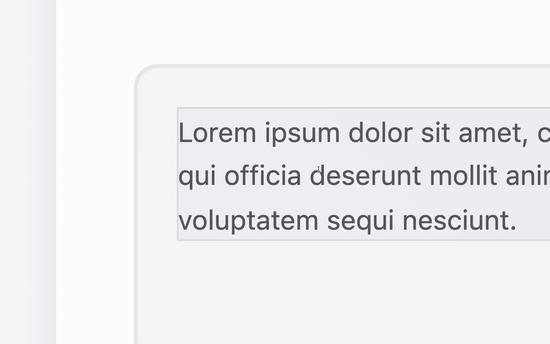

# Overfade
A lightweight library for making overflowing content fade out smoothly and dynamically.

# What makes it special
The library uses the `mask-image` property to fade out the desired edges. This allows it to play nicely with transparency.
What's more, it smoothly adjusts the mask image strength when scrolling content into the overflow using javascript.

# GIF examples

- Horizontal fade

- All-sides fade


# Installation & initialization
Install the library using `npm install overfade` and initialize it using:
```js
import init from "overfade";
init();
```

# Applying the effect
To fade-out the desired overflowing edges, use the following classes. You can combine them.

- `of-top`: Dynamically fade out the top edge
- `of-bottom`: Dynamically fade out the bottom edge
- `of-left`: Dynamically fade out the left edge
- `of-right`: Dynamically fade out the right edge

To control the length of the fade, use the `of-length-x`class. It defaults to 1, where 2 would be twice as long.

# Code example
```html
<div class="of-left of-right of-length-2">
    <p>This is a horizontally overflowing container with a longer fade.</p>
</div>
```